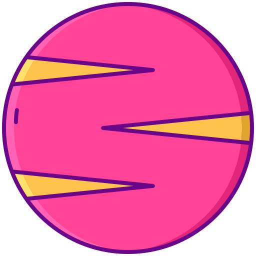

<div align="center">
    <a href="https://github.com/thiiagoms/venus">
        
    </a>
    <h3 align="center">Valid a set of urls :milky_way: </h3>
    <p float="left">
        
    </p>
</div>

- [Dependencies :package:](#dependecies)
- [Install :memo:](#install)
- [Run :runner:](#run)
- [Bonus :medal_sports:](#bonus)
- 
### Dependencies

- Docker :whale:

### Install

01 -) Clone:
```bash
$ git clone https://github.com/thiiagoms/venus
```

02 -) Change to `venus` directory:
```bash
$ cd venus
venus $
```

03 -) Stand up containers and Install dependencies with `composer` package manager:
```bash
venus $ docker-compose up -d
venus $ docker-compose exec venus composer install
```

### Run

01 -) You can execute the `example.php` about how to work with `venus`:

```bash
venus $ docker exec venus php example.php
```

```php
<?php

declare(strict_types=1);

require_once __DIR__ . '/bootstrap.php';

$urls = [
    'https://google.com',
    'https://www.exampleurlthatdoesnotexist.com',
    'https://github.com'
];

/** @var \Venus\Venus $app */
$app->scan($urls);

echo '[*] valid urls' . PHP_EOL;
print_r($app->getValidUrls());
/**
Array
(
    [0] => https://google.com
    [1] => https://github.com
)
*/

echo '[*] invalid urls' . PHP_EOL;
print_r($app->getInvalidUrls());
/**
Array
(
    [0] => https://www.exampleurlthatdoesnotexist.com
)
*/
```

## Bonus

01 -) Run tests:
```bash
venus $ docker exec venus composer tests
```

02 -) Run lint and run lint finx:
```bash
venus $ docker exec venus composer phpcs src
venus $ docker exec venus composer phpcbf src
```

03 -) Run `phpstan` (default with level 9) for code analyze:
```bash
venus $ docker exec venus composer phpstan 
```
